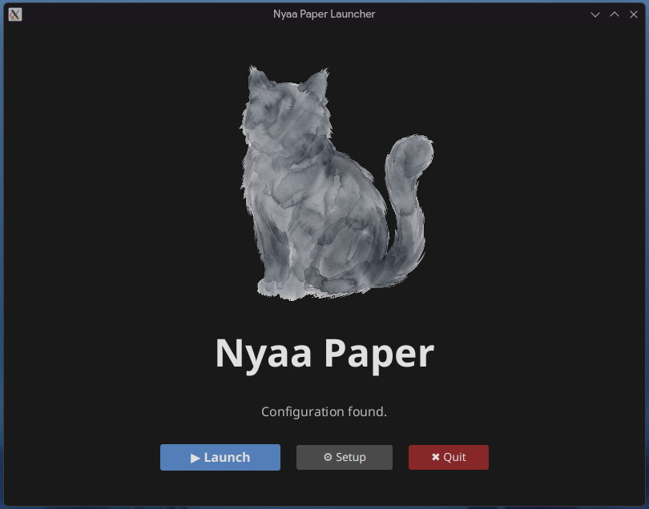
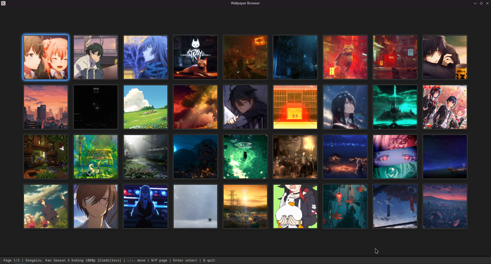
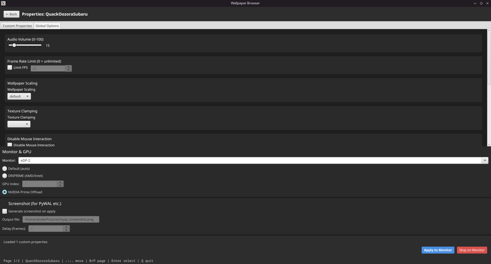

<p align="center">
  
</p>

<h1 align="center">Nyaa Paper</h1>
<p align="center">
  <em>A graphical front-end for linux-wallpaperengine – multi-monitor, system tray, self-contained fat JAR</em>
</p>

<p align="center">
  <a href="https://github.com/diode701/nyaa-paper/blob/main/LICENSE"></a>
  <a href="https://aur.archlinux.org/packages/nyaa-paper-bin"></a>
  <a href="https://github.com/diode701/nyaa-paper/releases"></a>
  <a href="https://github.com/diode701/nyaa-paper/actions"></a>
</p>

---

Nyaa Paper puts a graphical interface on top of **[linux-wallpaperengine](https://github.com/Almamu/linux-wallpaperengine)**.
Browse your Steam Workshop wallpapers, adjust their properties, assign them per monitor, and leave everything running in the system tray.

It's all baked into a single fat JAR – no Python, no C compilation, no dependency hell.
The core idea: *build issues with Python and C are awful – let's ship a self-contained JAR and move on.*

---

## What it does

- **Per-monitor wallpapers** – each screen can run a different wallpaper with its own settings
- **GPU selection** – per-wallpaper choice of Default, DRI_PRIME, or NVIDIA Prime Offload
- **Screenshot mode** – capture a frame right when the wallpaper starts (useful with PyWAL)
- **System tray** – close the browser, wallpapers keep running; restore later
- **Launcher** – always opens first, sets the JVM heap size, and lets you adjust paths and monitors
- **Workshop watcher** – newly subscribed wallpapers appear instantly; unsubscribed ones vanish
- **Custom properties** – sliders, colours, checkboxes, combo-boxes – whatever the wallpaper exposes
- **Keyboard navigation** – move, open, apply without touching the mouse

---

## Screenshots

| Launcher | Main browser | Global settings |
|----------|--------------|-----------------|
|  |  |  |

> *Launcher (left), wallpaper grid (centre), and the global options tab inside the properties view (right).*

---

## Installation

### Arch Linux (AUR)

```bash
yay -S nyaa-paper-bin       # or paru -S nyaa-paper-bin
```

The package ships everything pre-built – no compilation needed.
After installation, launch **`NyaaPaper`** from your app launcher or run **`nyaa-paper`** in a terminal.

### Other distributions – tarball / clone

Download the latest tarball from [Releases](https://github.com/diode701/nyaa-paper/releases) **or** clone the repository, then run the included installer:

```bash
tar xzf nyaa-paper-*.tar.gz && cd nyaa-paper
# or: git clone https://github.com/diode701/nyaa-paper.git && cd nyaa-paper

./install.sh
```

`install.sh`

- copies the JARs to `~/.local/share/NyaaPaper/`
- creates a launch script at `~/.local/bin/nyaa-paper`
- adds a `.desktop` entry so `NyaaPaper` appears in your app menu

An `uninstall.sh` is also provided if you ever need to remove everything.

To launch after installation, just use **`nyaa-paper`** in a terminal or **`NyaaPaper`** from your menu.
The launcher will handle the rest.

> **Requirements**
> - **Java 21** (or newer) – OpenJDK works fine
> - **linux-wallpaperengine** in your `PATH` ([AUR](https://aur.archlinux.org/packages/linux-wallpaperengine-git) or [manual build](https://github.com/Almamu/linux-wallpaperengine))
> - **xrandr** (almost always present; used for monitor detection)

---

## Build from source (optional)

If you prefer building yourself, a Gradle wrapper is included – no local Gradle setup required.

```bash
git clone https://github.com/diode701/nyaa-paper.git
cd nyaa-paper
./gradlew buildAll
```

The output goes into `build/libs/`:

- `nyaa-paper-launcher-<version>.jar` – the launcher / settings UI
- `nyaa-paper-app-<version>.jar` – the main wallpaper browser

After building you must launch the app manually with `java -jar`.
The `install.sh` script is **not** run automatically; building is mainly for development or packaging.

---

## Configuration

The launcher writes `~/.config/NyaaPaper/settings.json`.
A typical file looks like this:

```json
{
  "illogicalImpulse": false,
  "maxRam": 512,
  "steamPath": "/home/user/.local/share/Steam/steamapps/workshop/content/431960/",
  "pywalPath": "/home/user/.cache/wal/",
  "monitorConfig": "eDP-1,HDMI-1",
  "screenshotPath": "/home/user/Pictures/nyaa_screenshot.png",
  "nvidiaAvailable": false
}
```

| Key | Meaning |
|---|---|
| `illogicalImpulse` | (reserved for future integration) |
| `maxRam` | Java heap size (MB) the launcher passes to the main app |
| `steamPath` | Path to your Wallpaper Engine workshop directory |
| `pywalPath` | Path to your PyWAL cache (optional) |
| `monitorConfig` | Comma-separated list of monitors (`xrandr` names) |
| `screenshotPath` | Default output file for the screenshot feature |
| `nvidiaAvailable` | Auto-detected by the launcher; enables the NVIDIA radio button |

On first start the launcher shows a logo and then, after any key press, opens the settings tab where you can adjust all of these.
You can also force this settings screen at any time by launching with `nyaa-paper --setup`.

---

## Usage

1. **Launch**
   Run `NyaaPaper` (desktop) or `nyaa-paper` (terminal).
   The launcher opens. If no configuration exists, the settings tab appears automatically after the intro.
   Once you're happy with the settings, the launcher starts the main browser with the chosen heap size.

2. **Browse wallpapers**
   The grid shows all wallpapers found in your workshop folder.
   - Arrow keys move the selection
   - `N` / `P` go to the previous / next page
   - `Enter` opens the properties of the selected wallpaper
   - `Q` quits the application

3. **Customise and apply**
   Inside the **Properties** view you'll find
   - **Custom Properties** (what the wallpaper itself defines – sliders, colours, etc.)
   - **Global Options** (volume, FPS cap, scaling, clamping, audio flags, and toggles like "disable parallax")

   Below those you pick a **monitor**, a **GPU mode**, and optionally enable a **screenshot** on launch.
   Click **Apply to Monitor** (or press `Ctrl+Enter`) to start the wallpaper process.

4. **Tray and shutdown**
   You can close the browser window – the wallpapers stay active.
   Right-click the system tray icon to restore the browser or quit.
   A JVM shutdown hook ensures all wallpaper processes are killed even if the window is closed unexpectedly.

---

## GPU notes

Each wallpaper process receives environment variables based on the selected GPU mode:

- **Default** – no special variables
- **DRI_PRIME** – sets `DRI_PRIME=<card number>`
- **NVIDIA Prime Offload** – sets `__NV_PRIME_RENDER_OFFLOAD=1` and `__GLX_VENDOR_LIBRARY_NAME=nvidia`

These variables only influence **hybrid graphics** setups (iGPU + dGPU).
On laptops with a hardware MUX that hardwires display outputs to a specific GPU, environment variables **cannot** change which GPU renders – the routing is fixed by the physical design.

---

## Known issues

- **Custom property parsing** – rare wallpaper formats may not parse correctly. Only properties following the standard documented structure work.
- **Everything depends on linux-wallpaperengine** – if LWE doesn't work on your setup, Nyaa Paper can't fix that. Check LWE's compatibility with your display server (LWE has some Wayland support).
- **App icon** – the window or tray icon may not appear in some environments. Restarting the application does **not** reliably fix it.
- **Clamping** – the clamping option is deprecated and may not have any effect.

---

## Possible future additions

- Integration with **Illogical Impulse**
- Independent screenshots per monitor (no overwriting)
- Playlist / shuffle support
- Auto-start and persistent wallpaper config
- Better mouse-keyboard interactions
- Fixes for the taskbar / tray icon

---

## License

This project is licensed under the [Creative Commons Attribution-NonCommercial 4.0 International License](LICENSE).

---

## Credits

- **diode701** – development, design, and maintenance
- **[Almamu](https://github.com/Almamu/linux-wallpaperengine)** for creating the linux-wallpaperengine backend

<p align="center">
  <sub>Built over ~2 weeks of actual work (spread across a month of caffeine and spite), with DeepSeek assisting on UI code</sub>
</p>
