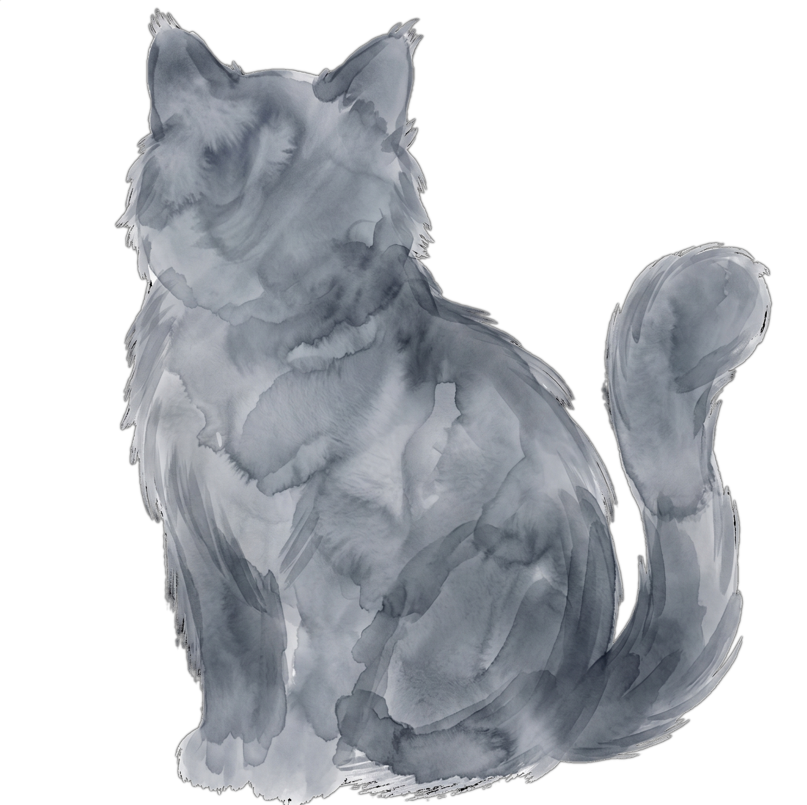

<p align="center">
  
</p>

<h1 align="center">Nyaa Paper</h1>
<p align="center">
  <em>~</em>
</p>

<p align="center">
  <a href="https://github.com/diode701/nyaa-paper/blob/main/LICENSE"></a>
  <a href="https://aur.archlinux.org/packages/nyaa-paper-bin"></a>
  <a href="https://github.com/diode701/nyaa-paper/releases"></a>
</p>

---

## ✨ Features

- 🖥️ **Multi‑monitor support** – assign different wallpapers to each screen
- 🎮 **GPU selection** – per‑wallpaper DRI_PRIME or NVIDIA Prime Offload
- 📸 **Screenshot mode** – integrate with PyWAL or other colour tools
- 📦 **System tray** – minimise to tray and restore later
- ⚙️ **First‑run launcher** – auto‑detects monitors, sets memory limits, and configures paths
- 🔄 **Workshop watcher** – automatically picks up new wallpapers

---


---

## 📥 Installation

### 1. AUR (Arch Linux / Manjaro)

```bash
yay -S nyaa-paper-bin
